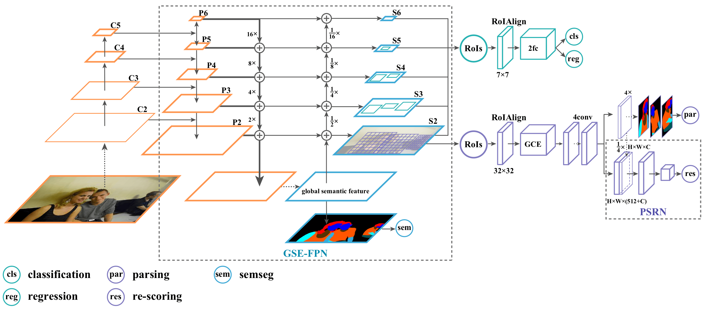

# RP-R-CNN
Official implementation of **Renovating Parsing R-CNN for Accurate Multiple Human Parsing (under review)**

In this repository, we release the RP R-CNN code in Pytorch.

- RP R-CNN architecture:
<p align="center"></p>

- RP R-CNN output:
<p align="center"></p>


## Citing RP R-CNN

If you use RP R-CNN, please use the following BibTeX entry.

```BibTeX
@inproceedings{yang2020eccv,
  title = {Renovating Parsing R-CNN for Accurate Multiple Human Parsing},
  author = {Lu Yang and Qing Song and Zhihui Wang and Mengjie Hu and Chun Liu and Xueshi Xin and Wenhe Jia and Songcen Xu},
  booktitle = {Proceedings of European Conference on Computer Vision (ECCV)},
  year = {2020}
}

```

## Installation
- 8 x TITAN RTX GPU
- pytorch1.4
- python3.6.8

Install RP R-CNN following [INSTALL.md](https://github.com/soeaver/RP-R-CNN/blob/master/INSTALL.md#install).


## Results and Models

**On CIHP**

|  Backbone  |  LR  | Det AP | mIoU |Parsing (APp50/APvol/PCP50) | DOWNLOAD |
|------------|:----:|:------:|:----:|:--------------------------:| :-------:|
|  baseline  |  3x  | 68.3   | 56.2 |      64.6/54.3/60.9        |          |
|  R-50-FPN  |  3x  | 67.3   | 58.2 |      71.6/58.3/62.2        |          |
|  R-50-FPN  |  6x  | 68.2   | 60.2 |      74.1/59.5/64.9        | [GoogleDrive](https://drive.google.com/drive/folders/1So_iJ-vQ2z4cMOeM9XlaQ7CcRNDxWHxx?usp=sharing)|
|    +tta    |  6x  | 73.1   | 61.8 |      77.2/61.2/70.5        |          |

**On MHP-v2**

|  Backbone  |  LR  | Det AP | mIoU |Parsing (APp50/APvol/PCP50) | DOWNLOAD |
|------------|:----:|:------:|:----:|:--------------------------:| :-------:|
|  baseline  |  3x  | 68.8   | 35.6 |      26.6/40.3/37.9        |          |
|  R-50-FPN  |  3x  | 68.1   | 37.3 |      40.5/45.2/39.2        |          |
|  R-50-FPN  |  6x  | 69.1   | 38.6 |      45.3/46.8/43.6        | [GoogleDrive](https://drive.google.com/drive/folders/1brKDrFmqVrLWFuU0uy660B_MREJenmMk?usp=sharing)|


- 'baseline' denotes our implementation [Parsing R-CNN](https://arxiv.org/abs/1811.12596).
- '+tta' denotes using test-time augmentation, including: soft-nms + bbox voting + h-flipping + multi-scale


**ImageNet pretrained weight**

- [R-50](https://drive.google.com/open?id=1EtqFhrFTdBJNbp67effArVrTNx4q_ELr)
- [X-101-32x8d](https://drive.google.com/open?id=1c4OSVZIZtDT49B0DTC0tK3vcRgJpzR9n)


## Training

To train a model with 8 GPUs run:
```
python -m torch.distributed.launch --nproc_per_node=8 tools/train_net.py --cfg cfgs/CIHP/e2e_rp_rcnn_R-50-FPN_3x_ms.yaml
```


## Evaluation

### multi-gpu evaluation,
```
python tools/test_net.py --cfg ckpts/CIHP/e2e_rp_rcnn_R-50-FPN_6x_ms/e2e_rp_rcnn_R-50-FPN_6x_ms.yaml --gpu_id 0,1,2,3,4,5,6,7
```

### single-gpu evaluation,
```
python tools/test_net.py --cfg ckpts/CIHP/e2e_rp_rcnn_R-50-FPN_6x_ms/e2e_rp_rcnn_R-50-FPN_6x_ms.yaml --gpu_id 0
```


## License
RP-R-CNN is released under the [MIT license](https://github.com/soeaver/RP-R-CNN/blob/master/LICENSE).
