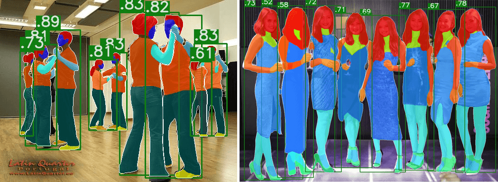

# Hier-R-CNN
Official implementation of **Hier R-CNN: Instance-level Human Parts Detection and A New Benchmark (under review)**

In this repository, we release the COCO Human Parts dataset and Hier R-CNN code in Pytorch.

- Hier R-CNN architecture:
<p align="center"></p>

- Hier R-CNN output:
<p align="center"></p>


## Installation
- 8 x TITAN Xp GPU
- pytorch1.1
- python3.6.8

Install Hier R-CNN following [INSTALL.md](https://github.com/soeaver/Hier-R-CNN/blob/master/INSTALL.md#install).


# Dataset

You can download the annotations of COCO Human Parts [here](https://drive.google.com/open?id=1pT8aOTlVskaAtMadeAHzRrnxnEIxZbV8). And following [Data](https://github.com/soeaver/Hier-R-CNN/blob/master/INSTALL.md#data-and-pre-train-weights) to train or evaluate Hier R-CNN models.


## Results and Models
|  Backbone  |  LR  | MS training | DCN | Det AP | Sub AP | DOWNLOAD |
|------------|:----:|:-----------:|:---:|:------:|:------:| :-------:|
|  R-50-FPN  |  1x  | No          | No  | 36.8   | 33.5   | [GoogleDrive](https://drive.google.com/open?id=1-nOef31NrjMyZXkK8fJRmPi-aRQJm7dS)|
|  R-50-FPN  |  2x  | Yes         | No  | 39.3   | 37.3   |          |
|  R-50-FPN  |  1x  | No          | Yes | 38.6   | 36.0   |          |
|  R-50-FPN  |  2x  | Yes         | Yes | 40.6   | 37.3   | [GoogleDrive](https://drive.google.com/open?id=1nrX26Uj7ymOpvPb0Q0AZEY97-43XJdLH)|
||
|  R-101-FPN |  1x  | No          | No  | 37.2   | 33.8   |          |
||
|  X-101-FPN |  1x  | No          | No  | 38.8   | 36.3   |          |
|  X-101-FPN |  2x  | Yes         | No  | 40.5   | 38.6   |          |
|  X-101-FPN |  1x  | No          | Yes | 40.3   | 37.1   |          |
|  X-101-FPN |  2x  | Yes         | Yes | 42.0   | 38.8   | [GoogleDrive](https://drive.google.com/open?id=1opxyPK3TU27W65r_OHxnsTvf8UJFV_hK)|

**ImageNet pretrained weight**

- [R50](https://drive.google.com/open?id=1EtqFhrFTdBJNbp67effArVrTNx4q_ELr)
- [X101-32x8d](https://drive.google.com/open?id=1c4OSVZIZtDT49B0DTC0tK3vcRgJpzR9n)


## Training

To train a model with 8 GPUs run:
```
python -m torch.distributed.launch --nproc_per_node=8 tools/train_net.py --cfg cfgs/mscoco_humanparts/e2e_hier_rcnn_R-50-FPN_1x.yaml
```


## Evaluation

### multi-gpu evaluation,
```
python tools/test_net.py --cfg ckpts/mscoco_humanparts/e2e_hier_rcnn_R-50-FPN_1x/e2e_hier_rcnn_R-50-FPN_1x.yaml --gpu_id 0,1,2,3,4,5,6,7
```

### single-gpu evaluation,
```
python tools/test_net.py --cfg ckpts/mscoco_humanparts/e2e_hier_rcnn_R-50-FPN_1x/e2e_hier_rcnn_R-50-FPN_1x.yaml --gpu_id 0
```


## License
Hier-R-CNN is released under the [MIT license](https://github.com/soeaver/Hier-R-CNN/blob/master/LICENSE).
